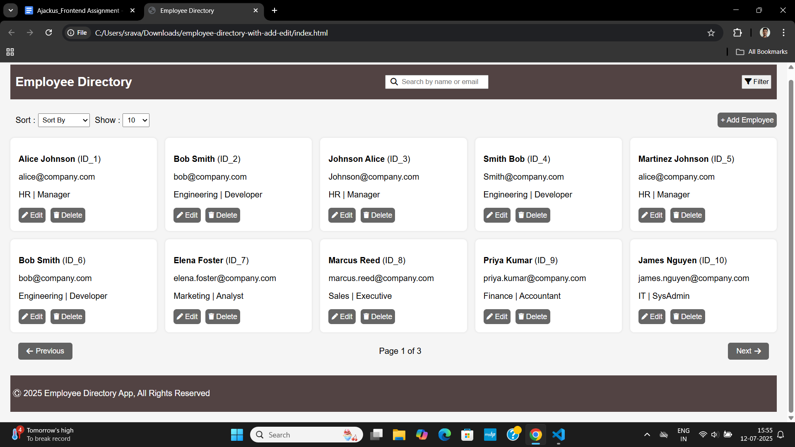
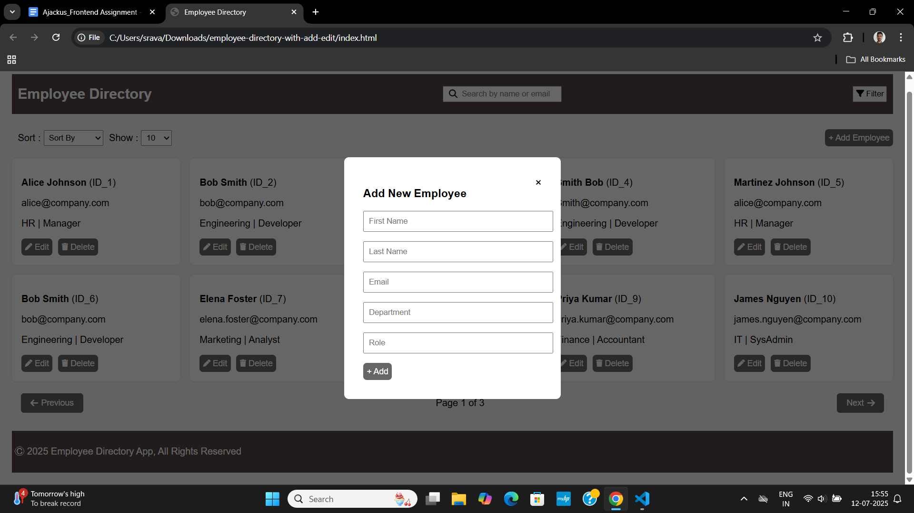
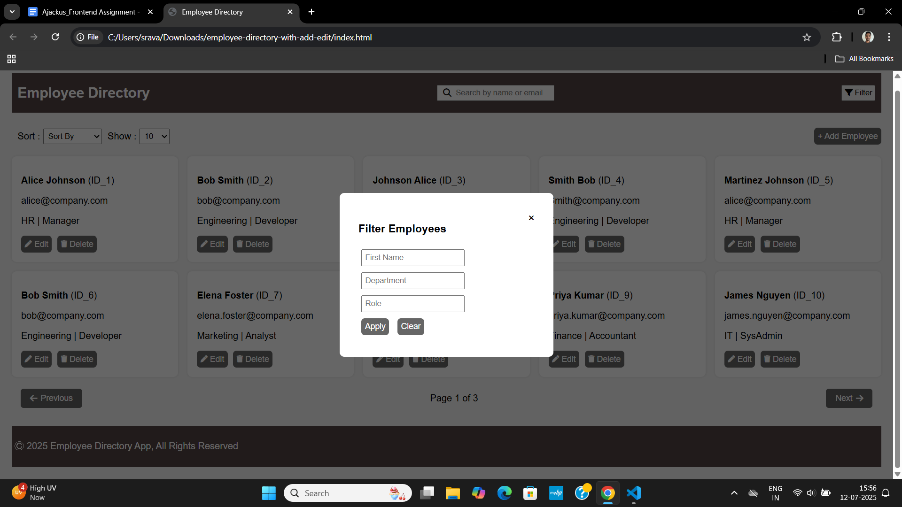

# Employee Directory – Frontend UI Assignment

This is a fully client-side implementation of an **Employee Directory** using **HTML, CSS, JavaScript**, and Freemarker-compatible templating. It includes features for managing employees with no backend required.

##  Features

-  Display employee list in a responsive grid
-  Search employees by name or email
-  Filter by first name, department, role
-  Sort by first name or department
-  Add new employee via modal form
-  Edit existing employee details
-  Delete employees
-  Pagination (10/25/50/100 per page) with Previous/Next buttons
-  Data persists using localStorage
-  Responsive design (desktop/tablet/mobile)
-  Form validation (email format, required fields)

##  How to Run

1. **Download or clone the repo**
2. Open `index.html` in your browser (no server needed)

##  Screenshots

### Challenges Faced
- Creating a modular layout that works without backend support
- Managing data updates (edit/delete) purely in memory

### What Could Be Improved
- (Improved) Now includes localStorage to persist data across refreshes
- Integration with a backend (Spring Boot/Freemarker) for full-stack setup
